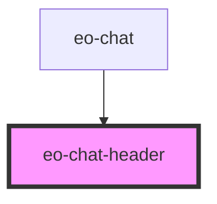

# eo-chat-header

<!-- Auto Generated Below -->

## Overview

LOCKED HEADER. The EvidenceOne logo (`LOGO_SVG`) is rendered here via
innerHTML and verified at runtime in componentDidLoad. There is no
brand-altering

## Properties

| Property             | Attribute               | Description                                                          | Type      | Default |
| -------------------- | ----------------------- | -------------------------------------------------------------------- | --------- | ------- |
| `canStartNewSession` | `can-start-new-session` | Offer "Nova conversa" only when there is an active session to reset. | `boolean` | `false` |

## Events

| Event                | Description | Type                |
| -------------------- | ----------- | ------------------- |
| `eoHeaderClose`      |             | `CustomEvent<void>` |
| `eoHeaderNewSession` |             | `CustomEvent<void>` |

## Dependencies

### Used by

 - [eo-chat](../eo-chat)

### Graph

----------------------------------------------

*Built with [StencilJS](https://stenciljs.com/)*
