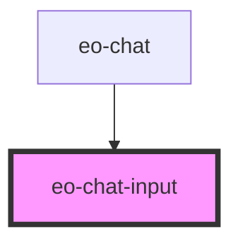

# eo-chat-input

<!-- Auto Generated Below -->

## Properties

| Property   | Attribute  | Description | Type      | Default |
| ---------- | ---------- | ----------- | --------- | ------- |
| `disabled` | `disabled` |             | `boolean` | `false` |

## Events

| Event           | Description | Type                  |
| --------------- | ----------- | --------------------- |
| `eoSendMessage` |             | `CustomEvent<string>` |

## Dependencies

### Used by

 - [eo-chat](../eo-chat)

### Graph

----------------------------------------------

*Built with [StencilJS](https://stenciljs.com/)*
