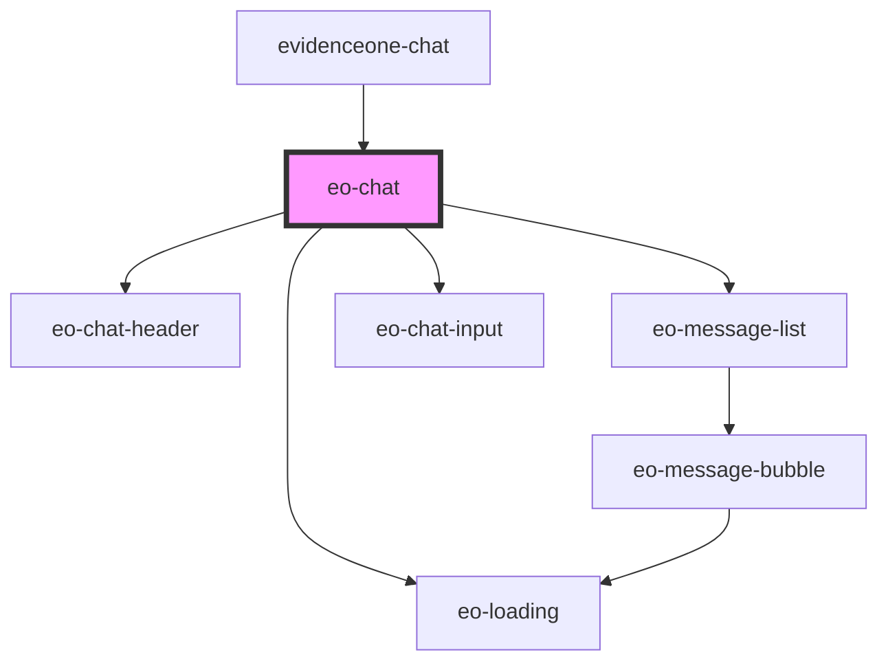

# eo-chat

<!-- Auto Generated Below -->

## Properties

| Property      | Attribute     | Description                                                          | Type                                        | Default     |
| ------------- | ------------- | -------------------------------------------------------------------- | ------------------------------------------- | ----------- |
| `authService` | --            |                                                                      | `AuthService`                               | `undefined` |
| `authStatus`  | `auth-status` |                                                                      | `"error" \| "idle" \| "loading" \| "ready"` | `'idle'`    |
| `chatService` | --            |                                                                      | `ChatService`                               | `undefined` |
| `doctorData`  | --            |                                                                      | `DoctorData`                                | `undefined` |
| `resetKey`    | `reset-key`   | Parent bumps this to force a reset (clears messages, aborts stream). | `number`                                    | `0`         |

## Events

| Event              | Description | Type                |
| ------------------ | ----------- | ------------------- |
| `eoChatClose`      |             | `CustomEvent<void>` |
| `eoChatNewSession` |             | `CustomEvent<void>` |

## Dependencies

### Used by

 - [evidenceone-chat](../evidenceone-chat)

### Depends on

- [eo-chat-header](../eo-chat-header)
- [eo-loading](../eo-loading)
- [eo-message-list](../eo-message-list)
- [eo-chat-input](../eo-chat-input)

### Graph

----------------------------------------------

*Built with [StencilJS](https://stenciljs.com/)*
