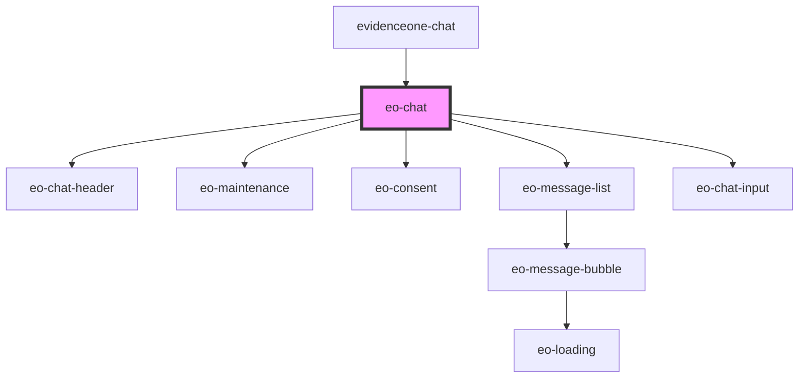

# eo-chat

<!-- Auto Generated Below -->

## Properties

| Property              | Attribute              | Description                                                                                                | Type                                                                  | Default     |
| --------------------- | ---------------------- | ---------------------------------------------------------------------------------------------------------- | --------------------------------------------------------------------- | ----------- |
| `authService`         | --                     |                                                                                                            | `AuthService`                                                         | `undefined` |
| `authStatus`          | `auth-status`          |                                                                                                            | `"blocked" \| "consent" \| "error" \| "idle" \| "loading" \| "ready"` | `'idle'`    |
| `chatService`         | --                     |                                                                                                            | `ChatService`                                                         | `undefined` |
| `consentError`        | `consent-error`        |                                                                                                            | `boolean`                                                             | `false`     |
| `consentReconsent`    | `consent-reconsent`    | Selects the consent screen's re-collection copy (widget-14).                                               | `boolean`                                                             | `false`     |
| `consentSaving`       | `consent-saving`       |                                                                                                            | `boolean`                                                             | `false`     |
| `maintenance`         | `maintenance`          | True while the service is unavailable — the maintenance screen replaces every body state and the composer. | `boolean`                                                             | `false`     |
| `maintenanceChecking` | `maintenance-checking` | True while the root re-checks availability after "Tentar novamente".                                       | `boolean`                                                             | `false`     |
| `resetKey`            | `reset-key`            | Parent bumps this to force a reset (clears messages, aborts stream).                                       | `number`                                                              | `0`         |

## Events

| Event                   | Description                                                                         | Type                |
| ----------------------- | ----------------------------------------------------------------------------------- | ------------------- |
| `eoChatClose`           |                                                                                     | `CustomEvent<void>` |
| `eoChatConsentRequired` | Emitted on 403 CONSENT_REQUIRED from the chat — parent swaps to the consent screen. | `CustomEvent<void>` |
| `eoChatNewSession`      |                                                                                     | `CustomEvent<void>` |
| `eoChatRetry`           | Emitted when the user retries from the blocked state — parent re-runs auth.         | `CustomEvent<void>` |

## Dependencies

### Used by

 - [evidenceone-chat](../evidenceone-chat)

### Depends on

- [eo-chat-header](../eo-chat-header)
- [eo-maintenance](../eo-maintenance)
- [eo-consent](../eo-consent)
- [eo-message-list](../eo-message-list)
- [eo-chat-input](../eo-chat-input)

### Graph

```mermaid
graph TD;
  eo-chat --> eo-chat-header
  eo-chat --> eo-maintenance
  eo-chat --> eo-consent
  eo-chat --> eo-message-list
  eo-chat --> eo-chat-input
  eo-message-list --> eo-message-bubble
  eo-message-bubble --> eo-loading
  evidenceone-chat --> eo-chat
  style eo-chat fill:#f9f,stroke:#333,stroke-width:4px
```

----------------------------------------------

*Built with [StencilJS](https://stenciljs.com/)*
