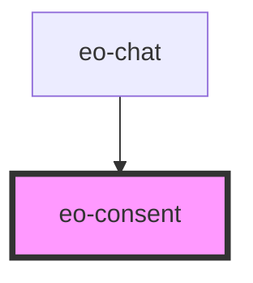

# eo-consent

<!-- Auto Generated Below -->

## Overview

Consent opt-in screen — gates the chat until the mandatory Terms checkbox
is accepted and the server confirms (parent owns the network call; this
component is presentation + a11y only).

Frozen design variants (spec §3.1): highlighted hierarchy, compact density,
gray disabled button.

## Properties

| Property    | Attribute   | Description                                                                                                                                                                                                                        | Type      | Default |
| ----------- | ----------- | ---------------------------------------------------------------------------------------------------------------------------------------------------------------------------------------------------------------------------------- | --------- | ------- |
| `error`     | `error`     | True when the last accept attempt failed — renders the error banner.                                                                                                                                                               | `boolean` | `false` |
| `reconsent` | `reconsent` | True when the user already accepted an older Terms version — swaps the description for the revision notice (widget-14). False (the default, and what servers without the `reconsent` field yield) keeps the first-acceptance copy. | `boolean` | `false` |
| `saving`    | `saving`    | True while the parent awaits the server's 201 — locks controls, shows spinner.                                                                                                                                                     | `boolean` | `false` |

## Events

| Event             | Description | Type                               |
| ----------------- | ----------- | ---------------------------------- |
| `eoConsentAccept` |             | `CustomEvent<{ comms: boolean; }>` |
| `eoConsentCancel` |             | `CustomEvent<void>`                |

## Dependencies

### Used by

 - [eo-chat](../eo-chat)

### Graph

----------------------------------------------

*Built with [StencilJS](https://stenciljs.com/)*
