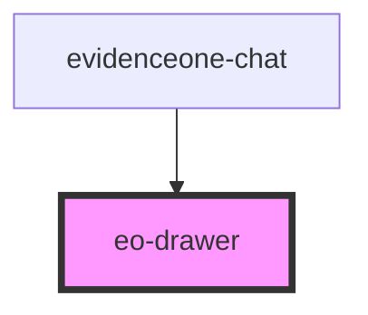

# eo-drawer

<!-- Auto Generated Below -->

## Properties

| Property | Attribute | Description | Type      | Default |
| -------- | --------- | ----------- | --------- | ------- |
| `isOpen` | `is-open` |             | `boolean` | `false` |

## Events

| Event           | Description | Type                |
| --------------- | ----------- | ------------------- |
| `eoDrawerClose` |             | `CustomEvent<void>` |

## Dependencies

### Used by

 - [evidenceone-chat](../evidenceone-chat)

### Graph

----------------------------------------------

*Built with [StencilJS](https://stenciljs.com/)*
