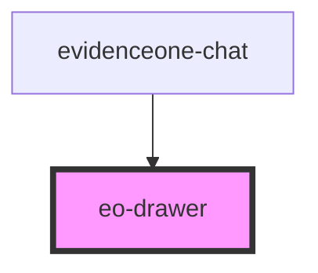

# eo-drawer

<!-- Auto Generated Below -->

## Properties

| Property    | Attribute    | Description                                                                                                                                                                         | Type                | Default     |
| ----------- | ------------ | ----------------------------------------------------------------------------------------------------------------------------------------------------------------------------------- | ------------------- | ----------- |
| `escCloses` | `esc-closes` | When false, Escape does not close the drawer. Root sets it false during the consent screen (spec §3.1 a11y) — backdrop/X still close (routed through the decline path by the root). | `boolean`           | `true`      |
| `isOpen`    | `is-open`    |                                                                                                                                                                                     | `boolean`           | `false`     |
| `side`      | `side`       | Which viewport edge the drawer slides in from. Set by root `evidenceone-chat` from its `placement` prop.                                                                            | `"left" \| "right"` | `'right'`   |
| `triggerEl` | --           | Element to restore keyboard focus to when the drawer closes. Parent (evidenceone-chat) captures this on trigger-button activation.                                                  | `HTMLElement`       | `undefined` |

## Events

| Event           | Description | Type                |
| --------------- | ----------- | ------------------- |
| `eoDrawerClose` |             | `CustomEvent<void>` |

## Dependencies

### Used by

 - [evidenceone-chat](../evidenceone-chat)

### Graph

```mermaid
graph TD;
  evidenceone-chat --> eo-drawer
  style eo-drawer fill:#f9f,stroke:#333,stroke-width:4px
```

----------------------------------------------

*Built with [StencilJS](https://stenciljs.com/)*
