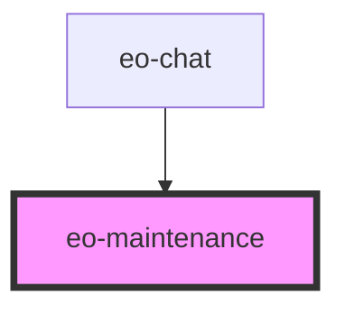

# eo-maintenance

<!-- Auto Generated Below -->

## Overview

Maintenance screen — replaces the chat body (and the composer) while the
EvidenceOne service is unavailable, so no question is sent in degraded
conditions. Presentation only: the parent owns the availability state and
the re-check behind "Tentar novamente".

## Properties

| Property   | Attribute  | Description                                                                               | Type      | Default |
| ---------- | ---------- | ----------------------------------------------------------------------------------------- | --------- | ------- |
| `checking` | `checking` | True while the parent re-checks availability — the screen stays up with a button spinner. | `boolean` | `false` |

## Events

| Event                | Description                                                        | Type                |
| -------------------- | ------------------------------------------------------------------ | ------------------- |
| `eoMaintenanceRetry` | Emitted on "Tentar novamente" — the parent re-checks availability. | `CustomEvent<void>` |

## Dependencies

### Used by

 - [eo-chat](../eo-chat)

### Graph

----------------------------------------------

*Built with [StencilJS](https://stenciljs.com/)*
