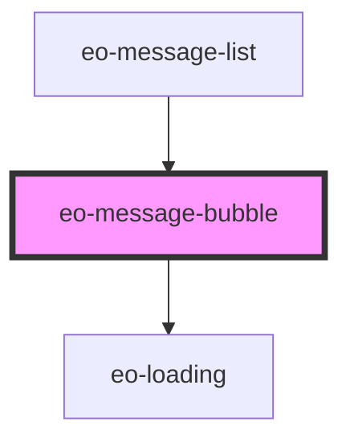

# eo-message-bubble

<!-- Auto Generated Below -->

## Properties

| Property      | Attribute      | Description | Type                    | Default  |
| ------------- | -------------- | ----------- | ----------------------- | -------- |
| `content`     | `content`      |             | `string`                | `''`     |
| `isStreaming` | `is-streaming` |             | `boolean`               | `false`  |
| `messageRole` | `message-role` |             | `"assistant" \| "user"` | `'user'` |

## Dependencies

### Used by

 - [eo-message-list](../eo-message-list)

### Depends on

- [eo-loading](../eo-loading)

### Graph

----------------------------------------------

*Built with [StencilJS](https://stenciljs.com/)*
