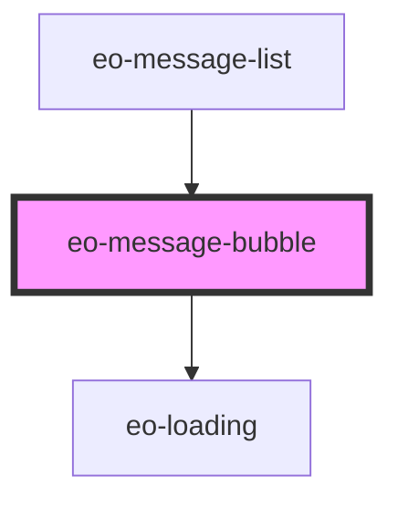

# eo-message-bubble

<!-- Auto Generated Below -->

## Properties

| Property       | Attribute       | Description                                                                   | Type                    | Default  |
| -------------- | --------------- | ----------------------------------------------------------------------------- | ----------------------- | -------- |
| `content`      | `content`       |                                                                               | `string`                | `''`     |
| `error`        | `error`         |                                                                               | `boolean`               | `false`  |
| `isStreaming`  | `is-streaming`  |                                                                               | `boolean`               | `false`  |
| `messageId`    | `message-id`    |                                                                               | `string`                | `''`     |
| `messageIndex` | `message-index` | Position within the conversation — carried on feedback votes (spec §3.3).     | `number`                | `-1`     |
| `messageRole`  | `message-role`  |                                                                               | `"assistant" \| "user"` | `'user'` |
| `sources`      | --              | Citations from the stream — the "Fontes" section renders only when non-empty. | `MessageSource[]`       | `[]`     |

## Events

| Event               | Description                                                                                | Type                                                           |
| ------------------- | ------------------------------------------------------------------------------------------ | -------------------------------------------------------------- |
| `eoMessageFeedback` | Internal seam — the root re-emits this as the public `eoFeedback` with sessionId attached. | `CustomEvent<{ messageIndex: number; vote: "up" \| "down"; }>` |
| `eoMessageRetry`    |                                                                                            | `CustomEvent<{ messageId: string; }>`                          |

## Dependencies

### Used by

 - [eo-message-list](../eo-message-list)

### Depends on

- [eo-loading](../eo-loading)

### Graph

```mermaid
graph TD;
  eo-message-bubble --> eo-loading
  eo-message-list --> eo-message-bubble
  style eo-message-bubble fill:#f9f,stroke:#333,stroke-width:4px
```

----------------------------------------------

*Built with [StencilJS](https://stenciljs.com/)*
