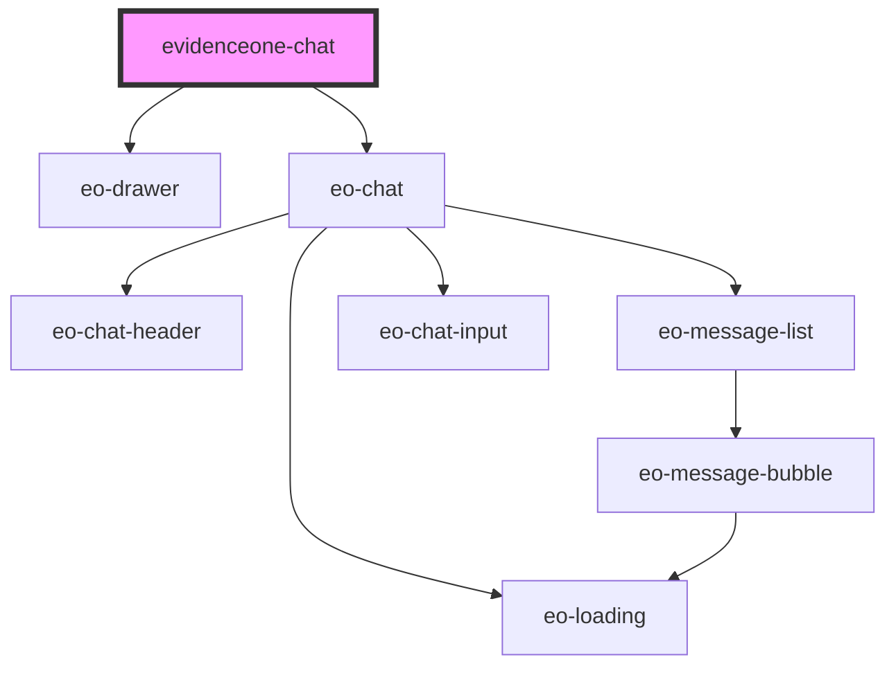

# evidenceone-chat

<!-- Auto Generated Below -->

## Overview

LOCKED PUBLIC API SURFACE — DO NOT EXTEND WITHOUT BRAND APPROVAL.

The visual customization the partner is allowed to perform is exhausted by
three typed enum props (buttonSize / placement / variant) and zero CSS knobs.

Specifically: NO

## Properties

| Property                   | Attribute          | Description                                                                                                                                                                                           | Type                     | Default      |
| -------------------------- | ------------------ | ----------------------------------------------------------------------------------------------------------------------------------------------------------------------------------------------------- | ------------------------ | ------------ |
| `apiKey` _(required)_      | `api-key`          |                                                                                                                                                                                                       | `string`                 | `undefined`  |
| `apiUrl` _(required)_      | `api-url`          |                                                                                                                                                                                                       | `string`                 | `undefined`  |
| `buttonSize`               | `button-size`      |                                                                                                                                                                                                       | `"lg" \| "md" \| "sm"`   | `'md'`       |
| `doctorCrm` _(required)_   | `doctor-crm`       |                                                                                                                                                                                                       | `string`                 | `undefined`  |
| `doctorEmail` _(required)_ | `doctor-email`     |                                                                                                                                                                                                       | `string`                 | `undefined`  |
| `doctorName` _(required)_  | `doctor-name`      |                                                                                                                                                                                                       | `string`                 | `undefined`  |
| `doctorPhone` _(required)_ | `doctor-phone`     |                                                                                                                                                                                                       | `string`                 | `undefined`  |
| `doctorSpecialty`          | `doctor-specialty` |                                                                                                                                                                                                       | `string`                 | `undefined`  |
| `hideButton`               | `hide-button`      |                                                                                                                                                                                                       | `boolean`                | `false`      |
| `newSession`               | `new-session`      |                                                                                                                                                                                                       | `boolean`                | `false`      |
| `partnerLookup`            | `partner-lookup`   | Optional generic lookup value (id, email, name — the partner decides) that keys a `{lookup}`-templated gateway URL on the server. Only meaningful in `partner_gateway` mode alongside `partnerToken`. | `string`                 | `undefined`  |
| `partnerToken`             | `partner-token`    | Opaque partner token for `partner_gateway` partners. When present, the server resolves the doctor profile from the partner's gateway and the doctor-* props are not required.                         | `string`                 | `undefined`  |
| `placement`                | `placement`        |                                                                                                                                                                                                       | `"left" \| "right"`      | `'right'`    |
| `variant`                  | `variant`          |                                                                                                                                                                                                       | `"floating" \| "inline"` | `'floating'` |

## Events

| Event       | Description                                                                           | Type                                  |
| ----------- | ------------------------------------------------------------------------------------- | ------------------------------------- |
| `eoBlocked` | Emitted when the partner session is blocked because the doctor profile is incomplete. | `CustomEvent<{ missing: string[]; }>` |
| `eoClose`   |                                                                                       | `CustomEvent<void>`                   |
| `eoError`   |                                                                                       | `CustomEvent<EoErrorDetail>`          |
| `eoReady`   |                                                                                       | `CustomEvent<{ sessionId: string; }>` |

## Methods

### `hide() => Promise<void>`

#### Returns

Type: `Promise<void>`

### `show() => Promise<void>`

#### Returns

Type: `Promise<void>`

## Dependencies

### Depends on

- [eo-drawer](../eo-drawer)
- [eo-chat](../eo-chat)

### Graph

----------------------------------------------

*Built with [StencilJS](https://stenciljs.com/)*
