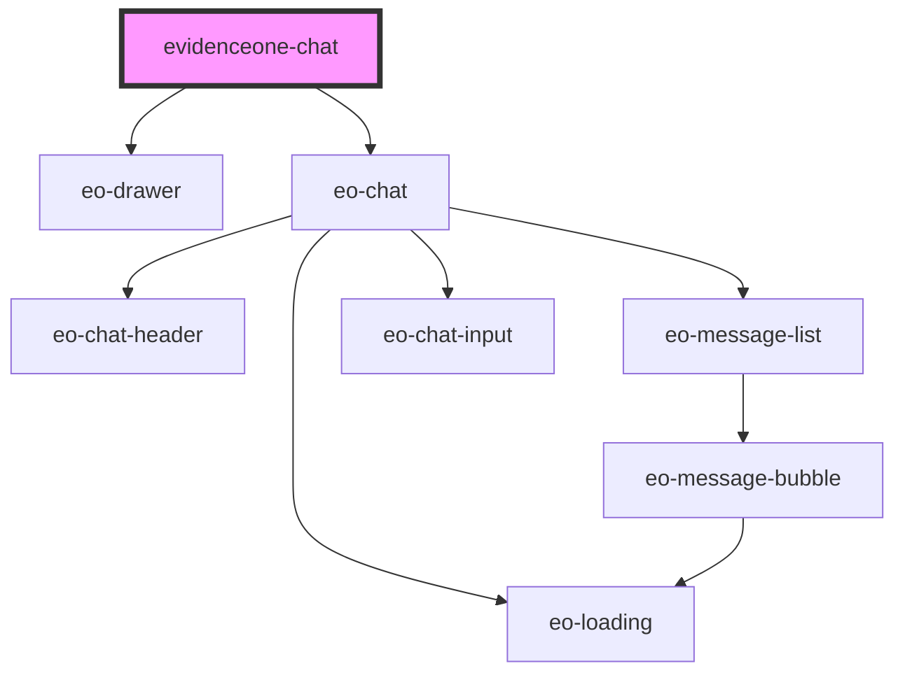

# evidenceone-chat

<!-- Auto Generated Below -->

## Properties

| Property                   | Attribute          | Description | Type      | Default     |
| -------------------------- | ------------------ | ----------- | --------- | ----------- |
| `apiKey` _(required)_      | `api-key`          |             | `string`  | `undefined` |
| `apiUrl` _(required)_      | `api-url`          |             | `string`  | `undefined` |
| `doctorCrm` _(required)_   | `doctor-crm`       |             | `string`  | `undefined` |
| `doctorEmail` _(required)_ | `doctor-email`     |             | `string`  | `undefined` |
| `doctorName` _(required)_  | `doctor-name`      |             | `string`  | `undefined` |
| `doctorPhone` _(required)_ | `doctor-phone`     |             | `string`  | `undefined` |
| `doctorSpecialty`          | `doctor-specialty` |             | `string`  | `undefined` |
| `hideButton`               | `hide-button`      |             | `boolean` | `false`     |
| `newSession`               | `new-session`      |             | `boolean` | `false`     |

## Events

| Event     | Description | Type                                  |
| --------- | ----------- | ------------------------------------- |
| `eoClose` |             | `CustomEvent<void>`                   |
| `eoError` |             | `CustomEvent<EoErrorDetail>`          |
| `eoReady` |             | `CustomEvent<{ sessionId: string; }>` |

## Methods

### `hide() => Promise<void>`

#### Returns

Type: `Promise<void>`

### `show() => Promise<void>`

#### Returns

Type: `Promise<void>`

## Dependencies

### Depends on

- [eo-drawer](../eo-drawer)
- [eo-chat](../eo-chat)

### Graph

----------------------------------------------

*Built with [StencilJS](https://stenciljs.com/)*
